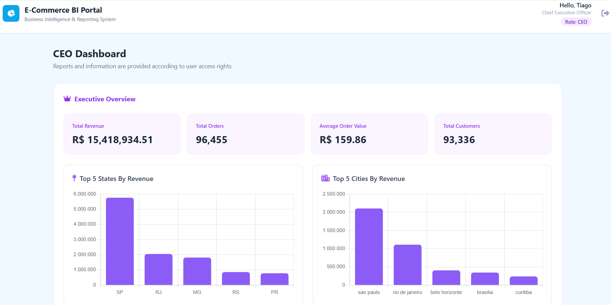

# Business Intelligence System Supporting E-commerce Business Performance Analysis

## Project Overview
This project focuses on building a Business Intelligence system to analyze e-commerce business performance using the **Brazilian E-Commerce Public Dataset by Olist** from **[Kaggle](https://www.kaggle.com/datasets/olistbr/brazilian-ecommerce)**.

The system covers end-to-end data processing, Data Warehouse development, business analytics, interactive dashboards, and machine learning-based revenue forecasting. All these features are integrated into a Web BI application featuring **user authentication** and **Role-Based Access Control (RBAC)**.

---

## Business Problem
E-commerce data was stored across different datasets, making it difficult to get a complete view of business performance. Manual reporting and data consolidation can be time-consuming and make it harder to monitor KPIs consistently.

---

## Project Objectives
- Analyze e-commerce business requirements.
- Execute an ETL (Extract - Transform - Load) pipeline using Python to extract, clean, transform, and load data.

- Load cleaned data into a Data Warehouse on SQL Server following the Star Schema model.
- Develop and evaluate a Machine Learning model for revenue forecasting to support business trend analysis.
- Build a Backend using Flask to handle data retrieval, business logic processing, and deliver REST APIs for the forecasting feature.
- Construct an interactive Web BI application supporting authentication (login/logout) and Role-Based Access Control (RBAC) to provide interactive analytical dashboards.
---

## Data & ETL Pipeline
The project utilizes the **Brazilian E-Commerce Public Dataset by Olist** (including core tables: *customers, orders, order items, products, payments*).

The ETL workflow includes:
- Data profiling and missing value handling.
- Data cleaning, standardization, and type transformation.
- Staging and loading cleaned data into SQL Server Data Warehouse.

---

## Data Warehouse Architecture
A **Star Schema** was designed and implemented in SQL Server, consisting of:
- **Fact Table:** `Sales_Fact` stores core sales transaction metrics including order IDs, product quantities, unit prices, freight values, and total payment amounts.

- **Dimension Tables:**
  - `Date_Dim`: stores temporal attributes (day, week, month, quarter, year) to enable time-series analysis and trend tracking.
  - `Customer_Dim`: stores customer identifiers, unique customer keys, cities, and states.
  - `Product_Dim`: stores product identifiers and category mappings.
  - `Payment_Dim`: stores payment method details and installment counts.

---

## Project Deliverables
- Python-based ETL Pipeline.
- SQL Server Data Warehouse using Star Schema.
- Revenue Forecasting Engine using XGBoost.
- Interactive Web BI Application with Hybrid SSR & REST API Architecture.
- Role-Based Access Control (RBAC) supporting different user roles, including CEO, Sales Manager, CMO, Data Analyst, and Admin.
---

## Tools & Technologies
- Data Analysis: Python, Pandas, NumPy, Jupyter Notebook
- Forecasting: XGBoost 
- Database & Data Warehouse: SQL Server, Star Schema
- Database Connector: PyODBC
- Web: Flask, REST API, Jinja2, HTML/CSS, Tailwind CSS, Chart.js

---

## Known Limitations & Future Improvements

While the system achieves its primary objectives, several limitations remain that offer opportunities for future enhancement:

- **Dataset Constraints:** The Olist dataset is a static public research dataset, which may not fully reflect real-time, dynamic e-commerce business operations. Automated real-time data sync pipeline is not yet implemented.

- **Data Ingestion Strictness:** The file import feature requires strict schema adherence. Missing fields necessary for Machine Learning will disable the revenue forecasting module, though analytical dashboards remain functional.

- **Forecasting:** The current XGBoost forecasting model primarily uses historical business data. Additional factors such as promotional campaigns, holidays, and market trends could be incorporated in future iterations. Multi-model comparison and evaluation could also be explored.

- **Production Readiness:** The system is evaluated in a development environment. Advanced production features—such as mobile-responsive views, system logging, real-time monitoring, automated backup/recovery, and enterprise security layers—are earmarked for future releases.